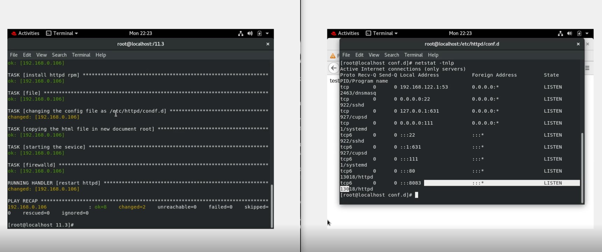

# HTTPD SERVICE AS IDEMPOTENT

PROBLEM STATEMENT:
The httpd service is not idempotent in nature, ie it always restarts the service if some changes been made in conf file or not.

INTITUTION:
With the use of notify and handler module, we made the httpd service restarts only when there is some change in conf file only.

