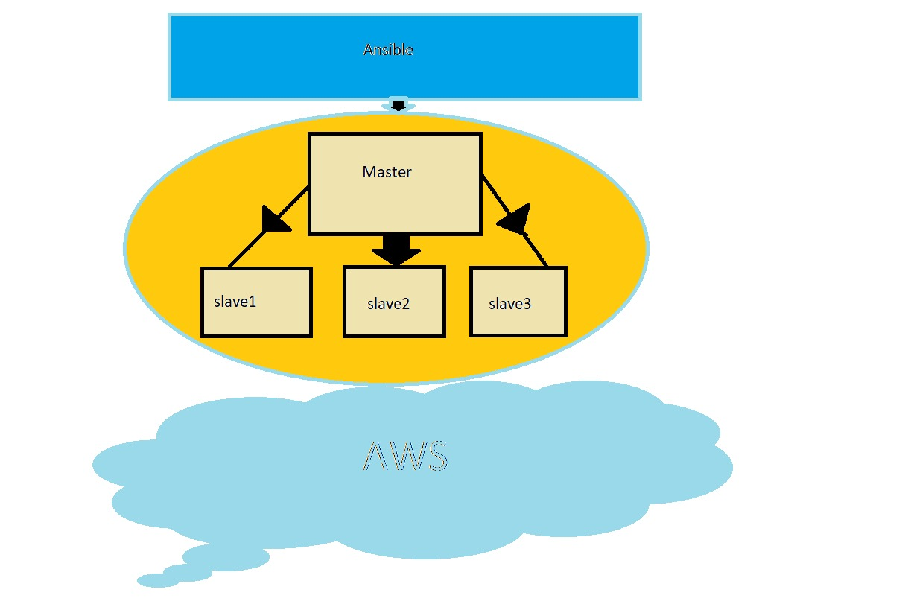
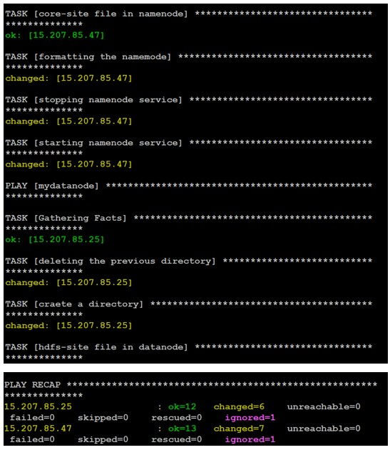
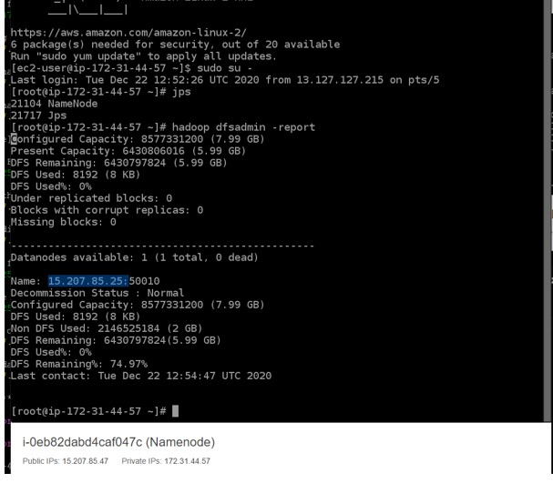
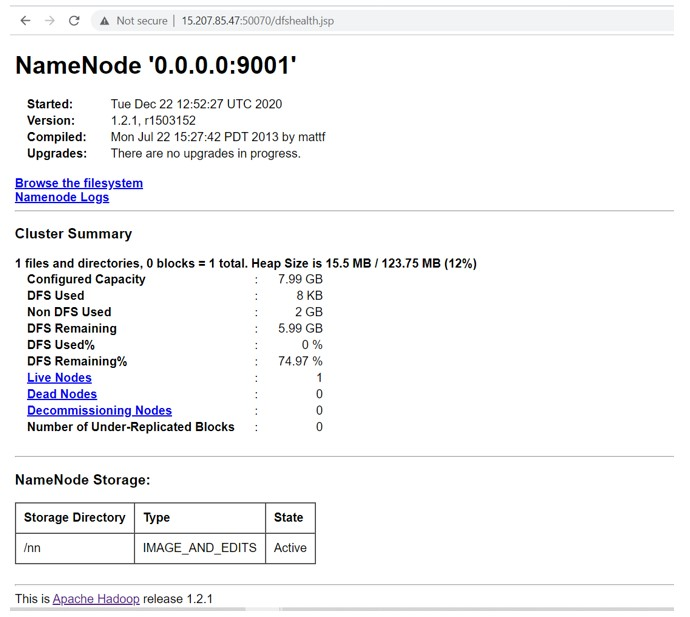

#1. Is Ansible used for automation? since decades before the development of Ansible, automation is been used.
Why Ansible now?

Earlier, automation was achieved by the scripting language by using the imperative approach, whcih means the script should include two things
1. what do you want to do?
2. How do you want to do.?

On the other hand, Ansible behaves intelligently. It has the declarative approach. The programmer has to tell jsut one thing.
1. What do you want to do?

Ansible automatically figures out how to do.

#2. POINTS

- [x] __Why Ansible?__

- [x] __Ansible automation has two ways:__

- [x] __USE CASE OF ANSIBLE IN AMAZON:__

- [x] __How AWS is using the ansible?__

- [x] __Ansible clarity and the power of AWS]__

- [x] __MANAGING CLOUD WITH ANSIBLE.__

- [x] __Cloud control with dynamic Inventory:__

- [x] __Migration made easy__

- [x] __Securely and Safely Automation with no latency.__

# Ansible PlayBook that does the following operations in the managed nodes:

- [x] __ Configure Docker__
- [x] __ Start and enable Docker services__
- [x] __ Pull the httpd server image from the Docker Hub__
- [x] __ Run the docker container and expose it to the public__
- [x] __ Copy the html code in /var/www/html directory and start the web server__

# HTTPD SERVICE AS IDEMPOTENT

PROBLEM STATEMENT:
The httpd service is not idempotent in nature, ie it always restarts the service if some changes been made in conf file or not.

INTITUTION:
With the use of notify and handler module, we made the httpd service restarts only when there is some change in conf file only.

# Configure Hadoop and start cluster services using Ansible Playbook

